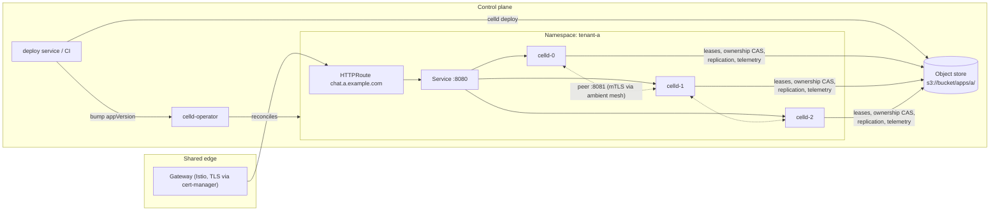

# celld-operator — Design

**Status:** Draft v1 · 2026-08-14
**Scope:** A Kubernetes operator and control plane that turns [celld](https://github.com/denoland/celld) into a self-hosted Cloudflare Workers & Durable Objects platform.

---

## 1. Motivation

[celld](https://celld.dev) is Deno Land's open-source (Apache-2.0) daemon that runs
Cloudflare Workers and Durable Objects on your own machines. Each object ("cell") is
its own SQLite database, replicated to an object-storage bucket the operator owns.
Nodes coordinate through that bucket alone — no control plane, no consensus service.

celld's own limitations page names what it deliberately does not have:

> A fleet runs one application deployment. There is no multi-tenant scheduler, no
> account service, or managed ingress.

Those three gaps are this product. celld supplies the runtime and the data plane;
**celld-operator supplies the control plane**: fleet provisioning, tenancy, ingress,
gated rollouts, deploys, secrets, and observability — built almost entirely from
Kubernetes-native objects, without patching celld itself. Keeping upstream unpatched
is a design constraint, not an accident: celld is a fast-moving alpha we do not
control (see §11).

### Positioning

"Self-host Cloudflare Workers" is the search phrase, but stateless self-hosted
Workers already exist — workerd is open source. What nobody else offers, and what
celld actually is, is **distributed, durable, self-hosted Durable Objects**: your
agents, rooms, documents, and tenants as named stateful cells on infrastructure you
control, with RPO=0 durability against a bucket you own. Lead with that. The
Workers-compatible build/deploy surface (esbuild + `wrangler.jsonc`) is retained
unchanged as the developer experience.

## 2. Goals and non-goals

### Goals

- Provision and operate one celld fleet per application from a single CRD.
- Correct, hands-off rollouts: the deploy-requires-restart model and the
  fleet-wide `restoring=0` gate encoded in a controller, not in runbooks.
- Retain the Workers build pipeline: standard Wrangler projects, esbuild,
  `celld deploy`, fail-loud config validation in CI.
- Tenancy with an honest isolation story: per-fleet blast radius enforced by
  Kubernetes and per-fleet bucket credentials.
- Per-tenant observability from celld's built-in telemetry, usable for both
  debugging and (later) metering.

### Non-goals

- **Hostile multi-tenant density.** celld's security page: *"not safe for hostile
  multi-tenant use."* We do not pack untrusted tenants into shared celld nodes,
  and we do not attempt Cloudflare's thousands-of-tenants-per-node economics.
  The experimental Worker Loader may change this later; we do not build on it now.
- **Patching celld.** The operator's celld-facing surface stays thin: env vars,
  signals, two HTTP endpoints (`/__celld/health`, internal `/state`).
- **Filling every Cloudflare platform gap.** KV, R2, and the Cache API are
  explicitly not planned upstream. We publish a compat matrix and ship only thin,
  honest shims (§10).
- Running or bundling the object store itself (§9).

## 3. celld facts this design depends on

Everything below is from celld's docs (`docs/README.md`, `docs/security.md`,
`docs/limitations.md`, `docs/fencing.md`, `docs/telemetry.md`,
`docs/cloudflare-compat.md`) and source as of v0.2.0. Each fact shapes a design
decision; if upstream changes one, revisit the referenced section here.

| # | Fact | Consequence here |
| --- | --- | --- |
| F1 | Two listeners: public (`--listen`, serves the Worker, reserves only `/__celld/health`) and internal (`--internal-listen`, peer protocol + **unauthenticated** operator API). | Separate Services; internal listener gets NetworkPolicy + AuthorizationPolicy, never a route (§6, §7). |
| F2 | Peers dial each other at the `--advertise` address; celld does not terminate TLS anywhere; docs require a trusted network or encrypted overlay. | Headless-service DNS for advertise; ambient-mesh mTLS for the pod network (§7). |
| F3 | One fleet runs one application deployment. | Fleet-per-app tenancy (§4). |
| F4 | Nodes load the app deployment from the bucket **at startup only**. | Deploys are bucket-publish **plus rolling restart**; the pod-template annotation is the rollout trigger (§8). |
| F5 | Rolling-update rule: after restarting a node, wait for **every** node to report `restoring=0` before the next restart. The restore work lands on the *peers*, not the replacement pod. | Vanilla rolling update is insufficient; partition-stepped rollout in the controller (§8). |
| F6 | SIGTERM starts a graceful drain: health flips to 503, new requests get 503+close, resident cells hand off to peers, bounded by `CELLD_SHUTDOWN_DRAIN_MS` (default 25000). | `terminationGracePeriodSeconds` > drain bound; 503-retries at the gateway; **no HTTP liveness probe on the health path** (§6). |
| F7 | The bucket must provide conditional create (`If-None-Match: *`), conditional overwrite (`If-Match`/ETag CAS), and read-after-write consistency. Bucket credentials are fleet-admin authority. | Qualified-store list, store qualification procedure, per-fleet credential scoping (§9, §4). |
| F8 | Some celld version upgrades are explicitly **not rolling-safe** (v0.1.0 → v0.2.0 required stop-all-then-start). Security fixes land on the latest release only. | Recreate strategy path in the controller; latest-only support policy (§8, §11). |
| F9 | Telemetry (`CELLD_OTEL=1`) writes Parquet traces/logs to the fleet bucket (DuckDB-queryable) or OTLP; W3C `traceparent` propagates both ways. No metrics yet. | Per-tenant observability and metering from the tenant's own telemetry prefix (§10). |
| F10 | No rebalancing on node join; placement is traffic-driven. Pressure shedding via `CELLD_MAX_RSS_MB` (default 80% of "available memory" — do not trust it to read cgroup limits). | Scale-up is soft; set memory bounds explicitly from the pod limit (§6). |
| F11 | `celld deploy` = esbuild + `wrangler.jsonc`/`.json` with a strict key allowlist; unknown keys fail the deploy loudly. `--dry-run` bundles without writing. | CI validation on PRs; clean surfaced errors instead of runtime surprises (§8). |

## 4. Tenancy model: fleet-per-app

Each application gets its own celld fleet — its own StatefulSet, namespace, bucket
prefix, and credentials. Tenancy lives at the Kubernetes layer, not inside celld.

**The isolation argument.** celld adds no sandbox beyond V8, so we assume the worst
case — a V8 isolate escape gives the attacker the whole node process. Under
fleet-per-app, that node holds only the tenant's own cells, and its bucket
credential (one IAM role per fleet, locked to `.../apps/<app>/` and nothing else)
reaches only the tenant's own prefix. **The blast radius of a full runtime
compromise is the tenant's own app.** For higher assurance tiers, pin fleets to
dedicated node pools for kernel-level separation. This is a defensible story for
an organization's apps or a vendor hosting its customers' apps; it is not a public
PaaS for anonymous hostile code (non-goal).

**The economics.** The unit of tenancy is a fleet — 2–3 pods minimum for HA — not
an isolate. Sizing note from celld's docs: one 8 GB node holds ~1,000 resident
cells; inactive cells cost approximately nothing. Density beyond fleet-per-app
waits on upstream (Worker Loader) maturing.

Fleets can share one physical bucket via key prefixes (celld supports
`s3://BUCKET/PREFIX`), which keeps store administration centralized while IAM
scoping keeps authority per-fleet.

## 5. Architecture overview



Components:

- **celld-operator** (this repo): watches `WorkerApp` CRs, reconciles the full
  per-fleet stack, and owns rollout sequencing.
- **Deploy service** (v1; CI-only in v0): builds Wrangler projects and publishes
  deployments to the fleet bucket, then updates the CR.
- **Shared edge**: one Istio Gateway (Gateway API) owned by the platform;
  one HTTPRoute per app, owned by the tenant namespace via ReferenceGrant.
- **Object store**: externally operated, qualified per §9. The bucket is celld's
  control plane and durability root; the operator provisions prefixes and
  credentials but never runs the store.

## 6. The WorkerApp CRD and reconciled resources

### CRD sketch

```yaml
apiVersion: platform.ezghcloud.com/v1alpha1
kind: WorkerApp
metadata:
  name: chat
  namespace: tenant-acme
spec:
  hostnames: ["chat.acme.example.com"]
  appVersion: "sha-abc123"          # deployment in the bucket; bump → gated rollout
  celld:
    image: ghcr.io/denoland/celld:v0.2.0
    updateStrategy: Rolling         # or Recreate, for upgrades flagged non-rolling (F8)
  replicas: 3
  bucket:
    name: s3://platform-cells/apps/chat   # prefix provisioned by the operator
    credentialsFrom: { iamRole: auto }    # IRSA / Workload Identity; scoped to prefix
  resources:
    memoryGi: 8
    maxResidentCells: 1000
  vars:
    secretRef: chat-vars            # mounted → CELLD_VARS_FILE
  websockets: true                  # drives ingress affinity + idle-timeout profile
  autoscaling:
    enabled: true
    minReplicas: 3                  # ≥ 2 for HA; also the PDB floor
    maxReplicas: 10
    targets:
      residentCellUtilization: 70   # % of maxResidentCells, fleet average
      p95LatencyMs: 250             # optional; from gateway (Istio) metrics
  telemetry:
    enabled: true
    retention: 30d
status:
  phase: Ready | RollingOut | Degraded | Recreating
  rolledOutAppVersion: "sha-abc123"
  rollout: { partition: 0, waitingOn: "" }
  fleet: { ready: 3, restoring: 0 }
  conditions: [...]
```

### What the operator reconciles per WorkerApp

**StatefulSet** (chosen over Deployment for stable advertise identity, F2, and to
enable the `handoff=preserve` fast-reload optimization later):

- Headless Service `celld-internal`; each pod advertises
  `$(POD_NAME).celld-internal.$(NS).svc.cluster.local:8081`.
- Env: `CELLD_BUCKET`, `CELLD_INTERNAL_ADDR=0.0.0.0:8081`, `CELLD_ADVERTISE` (above),
  `CELLD_SHUTDOWN_DRAIN_MS=25000`, `CELLD_MAX_RESIDENT_CELLS`,
  `CELLD_MAX_RSS_MB` **set explicitly ≈80% of the container memory limit** (F10),
  `CELLD_VARS_FILE` from the vars Secret, `CELLD_OTEL=1`.
- `terminationGracePeriodSeconds` = drain bound + margin (40s at the default
  25s drain) so the orchestrator never SIGKILLs a draining node (F6).
- Readiness probe: HTTP GET `/__celld/health` on :8080 (503 during drain pulls
  the pod from EndpointSlices — the built-in drain signal, F6).
- **Liveness probe: TCP-socket only, or none.** An HTTP liveness probe on the
  health path kills nodes mid-drain, converting every graceful handoff into the
  abrupt-kill path (F6). Enforced by the operator, not left to templates.
- Pod-template annotation `celld.platform/app-version: <spec.appVersion>` — the
  declarative rollout trigger (F4).
- `CELLD_WATCH` volume: emptyDir by default; PVC when preserve-handoff lands.
- `updateStrategy.rollingUpdate.partition` owned by the rollout controller (§8) —
  never by hand, never by GitOps directly.

**Services & ingress:** public Service :8080; HTTPRoute binding
`spec.hostnames` to it on the shared Gateway (ReferenceGrant included); TLS via
cert-manager. Route policy:

- **Retries on 503** at the gateway. A draining node answers new requests with
  503+close and expects the client to retry on a healthy node (F6); the gateway
  is that client, making drains invisible to end users. Istio's default retryOn
  does not cover 503 responses, so this is explicit route config.
- **WebSocket profile** (`spec.websockets: true`): generous stream/idle timeouts
  so quiet hibernated sockets are not severed; documented client-ping +
  `setWebSocketAutoResponse` pattern keeps proxies' idle clocks resetting without
  waking hibernated cells; DestinationRule consistent-hash affinity as a
  warm-path optimization (correctness never depends on it — celld's peer tunnel
  serves any cell from any node).

**Security wrapping** (F1, F2):

- NetworkPolicy: :8081 ingress from fleet pods only; nothing else.
- Istio **ambient** mesh: ztunnel L4 mTLS satisfies celld's encrypted-overlay
  requirement; AuthorizationPolicy pins :8081 to the fleet's ServiceAccount.
  Ambient specifically, not sidecars: celld's drain makes outbound peer and
  bucket calls *during termination*, and a sidecar exiting first would break the
  handoff; an L7 proxy also has no business touching the HMAC-signed,
  body-bound peer protocol.
- PodDisruptionBudget `maxUnavailable: 1` so node maintenance drains serially.
- Per-fleet IAM role (IRSA / Workload Identity — celld's credential chain accepts
  web identity tokens) scoped to the fleet's bucket prefix. No static keys.

## 7. Trust boundaries

| Boundary | Mechanism |
| --- | --- |
| Internet → Worker | Gateway: TLS termination, per-host routing; app-level auth is the tenant's job (celld does not authenticate end users) |
| Tenant ↔ tenant | Namespace + NetworkPolicy + fleet-scoped IAM; optional dedicated node pools |
| Anything → operator API (:8081) | Unauthenticated by design upstream → NetworkPolicy + AuthorizationPolicy; only fleet pods and the operator reach it; never routed |
| Node ↔ node (peer protocol) | celld's own HMAC/replay auth **plus** ambient mTLS for confidentiality |
| Fleet → bucket | Per-fleet IAM role, prefix-scoped; bucket credential = fleet-admin authority, so scoping *is* the tenancy enforcement |
| Operator → fleets | Operator's own ServiceAccount; the only cross-namespace :8081 caller |

## 8. Deploys and rollouts

### The deploy pipeline (Workers builds retained)

`celld deploy` already is a standard Wrangler build: esbuild from `PATH`,
`wrangler.jsonc`/`.json`, strict config-key allowlist (`name`, `main`,
`compatibility_date/_flags`, `durable_objects`, `migrations`, `assets`,
`services`, `vars`), unknown keys fail loudly (F11). The platform pipeline:

1. **PR validation:** pinned esbuild + `celld deploy . --dry-run`. Unsupported
   config keys fail here, with a clean named-key error — never at runtime.
2. **Publish:** on merge, `celld deploy .` against the fleet's bucket prefix.
   The bucket now holds the new deployment; **nothing is serving it yet** (F4).
3. **Roll out:** set `spec.appVersion` on the WorkerApp (v0: CI/GitOps commits
   the bump; v1: the deploy service does it). The template annotation changes,
   and the rollout controller takes over.

Secrets and vars: Kubernetes Secret → `CELLD_VARS_FILE` (env-file format);
the operator digests every referenced Secret into a pod-template annotation,
so a rotation changes the template and rolls the fleet through the ordinary
gated rollout. Never baked into bundles.

A `wrangler deploy`-compatible API endpoint is deliberately deferred: celld's
deploy path is intentionally not Cloudflare-API-shaped, and a platform CLI
(`platform deploy`, wrapping the same build) delivers product-grade DX without
chasing Cloudflare's API surface.

### The rollout controller (the reason this operator exists)

Vanilla StatefulSet RollingUpdate gates each step on the **new pod's** readiness.
celld's documented gate is different: fleet-wide `restoring=0` before the next
restart — and the restore work lands on the **peers** that absorbed the drained
node's cells, not on the replacement pod (F5). A stock rolling update therefore
runs ahead of the fleet's real recovery. Not a data-loss risk (the bucket is
authoritative, RPO=0) but a cold-start latency storm: warm capacity leaves faster
than the fleet re-warms.

The controller implements the documented procedure with the partition mechanism:

```
on template change (appVersion or image bump):
  partition ← replicas                     # freeze: no pod updates yet
  for ordinal in (replicas-1) … 0:
    partition ← ordinal                    # release exactly one pod
    wait: pod[ordinal] Ready
    wait: every fleet pod reports /state restoring == 0   # internal listener
    wait: settleSeconds (configurable damper)
  partition ← 0; status.rolledOutAppVersion ← appVersion
abort/hold: if any wait exceeds its budget → phase Degraded, hold partition,
  surface condition; never proceed past a churning fleet
```

The `restoring` poll uses the same internal `/state` the docs point operators at;
the operator is the one authorized cross-namespace caller (§7).

### Non-rolling celld upgrades (F8)

Some upstream version bumps are stop-all-then-start (v0.1.0 → v0.2.0: advertise
records and block-object formats changed; mixed fleets are forbidden). The
operator ships a version-compatibility table (maintained from celld release
notes) and refuses a Rolling strategy across a flagged boundary; the CR's
`celld.updateStrategy: Recreate` path scales the fleet to zero, waits for drain
completion, updates, and scales back up — an availability event by design, so it
is surfaced in status and requires the strategy to be set explicitly. A GitOps
diff alone must not be able to create a mixed fleet.

### Autoscaling on custom metrics

CPU is the wrong primary signal for celld: fleets are capacity-bound by
**resident cells and memory**, and upstream ships no metrics endpoint (F9). The
platform closes both gaps itself.

**Metrics source.** The operator already polls each fleet's internal `/state`
for rollout gating (§7 makes it the one authorized caller); it re-exports what
it sees as Prometheus metrics, per WorkerApp and per pod:

- `celld_resident_cells` and `celld_resident_cell_utilization`
  (occupied / `CELLD_MAX_RESIDENT_CELLS`) — the primary capacity dimension
- `celld_restoring`, `celld_evicting` — churn signals (used to *hold* scaling,
  not to trigger it)
- `celld_shedding` — pressure shedding active; a node in this state refuses new
  cell acquisitions, so it is the hard "out of capacity" signal
- `celld_websockets` — live socket count, for scale-down policy

**Scaler.** KEDA `ScaledObject` per WorkerApp (created by the operator when
`spec.autoscaling.enabled`), targeting the StatefulSet: a Prometheus scaler on
`celld_resident_cell_utilization` vs. the CR's target, plus an optional
gateway-side scaler on Istio request metrics (p95 latency or RPS per pod) so
traffic-bound stateless-Worker-heavy apps scale even when cell counts are low.
Any shedding pod immediately satisfies the scale-up condition regardless of the
average.

**celld-specific policy, encoded by the operator rather than left to tuning:**

- **Scale up early, expect slow absorption.** celld has no rebalancer (F10): a
  new pod is a spare that fills only as traffic activates unowned cells or as
  pressure shedding releases them. Hence a conservative default target (70%)
  and the shedding fast-path — by the time shedding starts, the fleet is
  already rebalancing the hard way.
- **Scale down slowly, and never during churn.** Removing a pod is a graceful
  drain, but it hands off that node's cells (cold restores on peers) and closes
  its WebSockets (clients reconnect). Defaults: long scale-down stabilization
  window (≥ 10 min), one pod at a time; for `websockets: true` apps the window
  stretches further and `celld_websockets` weighs against the decision.
- **Autoscaling and rollouts do not fight.** While `status.phase` is
  RollingOut/Recreating, the operator pauses the ScaledObject (KEDA pause
  annotation) and pins replicas; the rollout controller's partition arithmetic
  assumes a stable replica count. Scaling resumes when the fleet reports
  `restoring=0`.
- `minReplicas` ≥ 2 for HA and consistent with the PDB; `maxReplicas` is the
  tenant's cost ceiling and a quota hook (§10).

## 9. Object store requirements

The bucket is both control plane and durability root. celld's fencing contract
(F7) requires: conditional create (`If-None-Match: *`), conditional overwrite
(ETag CAS via `If-Match`), read-after-write consistency. A store that accepts the
headers without enforcing them fails **late and silently**: two nodes own one
cell — split brain.

- **Qualified (per celld docs):** Amazon S3, Cloudflare R2, Google Cloud Storage,
  Azure Blob, Tigris. celld's release tests run against R2.
- **Disqualified (per celld docs):** MinIO community edition, Backblaze B2,
  Hetzner, DigitalOcean Spaces.
- **Unproven — treat as disqualified until qualified:** RustFS and other young
  S3-compatibles. As of early 2026 RustFS's conditional-request layer had open
  correctness issues (e.g. ETag parse-level rejections breaking conditional ops).

**Qualification procedure** for any candidate store, rerun on every store
upgrade:

1. celld's live CAS contract test (`crates/celld/bucket.rs`,
   `put_cas_contract_against_real_bucket`): create / reject-create / update /
   reject-stale, via `CELLD_CAS_LIVE=1 … cargo test -p celld put_cas_contract`.
2. A concurrency hammer (this repo, `hack/cas-hammer`): N concurrent CAS writers
   per key, assert exactly one winner per round. The sequential test proves the
   condition is applied; only the hammer probes atomicity under race.

**Failure domains:** the platform does not run the store, and the store must not
live in the same cluster as the fleets — a cluster incident must not take out
compute and the source of truth together. RPO=0 is inherited from the store's
durability; that is the argument for a managed store even in otherwise
self-hosted deployments.

## 10. Observability, compat surface, and shims

**Per-tenant observability** falls out of celld's telemetry (F9): `CELLD_OTEL=1`
writes Parquet traces and logs under the tenant's own `telemetry/` prefix —
per-tenant isolated by construction, DuckDB-queryable with no additional
services. The gateway's OpenTelemetry tracing (W3C propagation) joins edge spans
to Worker and Durable Object spans via `traceparent` with zero app code. v1
ships dashboards over the Parquet; metering/quotas derive from the same spans
(request counts, durations, queue waits). Upstream has no metrics signal yet;
until it does, the operator's `/state`-derived Prometheus export (§8,
Autoscaling) is the platform's metrics plane — the same series drive
autoscaling, dashboards, and alerting — and request rates are derived from
spans.

**Compat matrix as a product page.** Supported: module Workers, Durable Objects
(SQLite storage, alarms, hibernatable WebSockets), JS RPC, service bindings,
static assets, `vars`, WebAssembly, substantial `node:` subset. Not available
and not planned upstream: KV, R2, Cache API, cron `scheduled` handlers,
HTMLRewriter. Planned upstream: D1, Workflows, Queues (all DO-shaped). The
platform's rule mirrors celld's: a gap fails loudly, never silently.

**Shims** (thin, honest, platform-level — no fake bindings):

- *Cron:* a platform-provided scheduler cell fires Durable Object alarms on a
  schedule — DO alarms are first-class upstream.
- *Blob storage:* documented pattern + scoped credentials for real S3/R2 via
  `fetch`, rather than a pretend R2 binding (upstream R2 binding methods throw).
- *D1:* adopt upstream when it lands; do not front-run it.

## 11. Risks

| Risk | Assessment | Mitigation |
| --- | --- | --- |
| **Vendor:** celld is Deno Land's fast-moving alpha; `celld.dev` is theirs; contributions are email patches under a rights-assigning CLA; they are well positioned to ship this same product (adjacent to Deno Deploy). | High — the existential one | Apache-2.0 keeps the base clean; keep the celld-facing surface thin (env, signals, 2 HTTP endpoints); track head closely; forkability is the fallback, not the plan |
| **Alpha operator API:** internal `/state` & `/shutdown` are explicitly unstable. | Medium | Version-pin operator↔celld pairs; the compat table (§8) gates upgrades |
| **Security-fix policy:** latest release only. | Medium | Product support policy mirrors it: current celld only; operator automates prompt upgrades |
| **Non-rolling upgrades recur.** | Known, bounded | Recreate path + compat table (§8); surfaced as an availability event, never silent |
| **Isolation ceiling:** fleet-per-app economics can't serve hostile-tenant PaaS ambitions. | Accepted by positioning | Revisit when Worker Loader stabilizes upstream |
| **Store misqualification** (silent CAS failure → split brain). | Low likelihood, catastrophic impact | §9 procedure; qualified-list default; hammer in CI against staging stores |

## 12. Roadmap

- **v0 — the operator.** WorkerApp CRD; full per-fleet reconciliation (§6);
  gated rollout controller + Recreate path (§8); shared Gateway wiring;
  per-fleet bucket prefixes + IAM; `/state`-derived Prometheus metrics export;
  GitOps-only deploys; `hack/cas-hammer`.
  *Usable as "self-hosted Workers platform" by an internal platform team.*
- **v1 — the DX.** Deploy CLI/API (dry-run PR checks, publish, version bump);
  KEDA custom-metrics autoscaling (§8); secrets flow; per-tenant trace/log
  dashboards over telemetry Parquet; custom domains; compat-matrix docs site.
- **v2 — platform services.** Cron shim; D1 adoption when upstream lands;
  quotas/metering from spans; density experiments behind Worker Loader once it
  leaves experimental status.

## 13. Open questions

1. Automating the celld version-compat table — parse release notes, or maintain
   by hand with a release checklist?
2. Bucket/IAM provisioning backend: Crossplane, ACK/Config Connector, or a
   built-in minimal provisioner?
3. Multi-cluster / multi-region fleets: celld's bucket-coordination model may
   allow a fleet spanning clusters over one bucket — latency and advertise
   reachability need a spike.
4. `handoff=preserve` fast reloads (StatefulSet + PVC + stable `CELLD_NODE`):
   worth adopting while the operator API is alpha?
5. How far to take `wrangler` CLI compatibility vs. owning the platform CLI.
