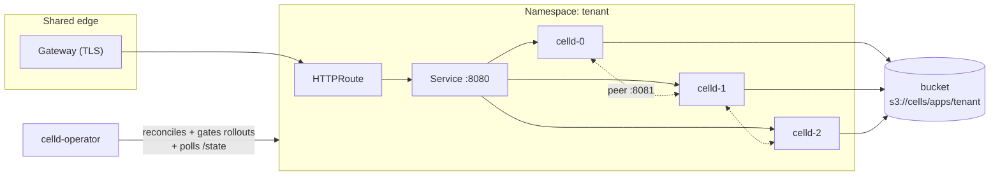

# celld-operator

**Run Cloudflare Workers and Durable Objects on your own Kubernetes cluster.**

celld-operator is a Kubernetes operator for [celld](https://github.com/denoland/celld),
Deno Land's open-source daemon that executes Wrangler-built Workers and Durable
Objects against an object-storage bucket you own. celld deliberately ships with
no multi-tenant scheduler, no account service, and no managed ingress — this
operator supplies that control plane. One `WorkerApp` custom resource
provisions and operates a complete celld fleet: workload, networking, security
policy, ingress, gated rollouts, metrics, and autoscaling.

**Documentation: [celld-operator.io](https://celld-operator.io)** — installation,
the WorkerApp reference, networking, autoscaling, and operations guides.

> **Status: alpha.** celld itself is an alpha and this operator tracks it
> release-for-release. The celld behaviors the operator encodes are indexed
> in [docs/celld-behaviors.md](docs/celld-behaviors.md); this README is the
> operational guide.

## How it works

celld nodes coordinate through a bucket — deployments, cell state (one SQLite
database per Durable Object), ownership leases — with no consensus service.
The operator turns one `WorkerApp` into one fleet of celld pods sharing a
bucket prefix, and encodes celld's operational rules (drain semantics, rollout
gating, memory bounds) so they cannot be misconfigured:



Each application is its own fleet with its own bucket prefix and its own
credentials — tenancy lives at the Kubernetes layer. Even a full runtime
compromise inside one fleet reaches only that app's pods and that app's
prefix. This is a platform for *your* applications (or your customers' apps
under your operation), not for anonymous hostile code.

## Prerequisites

- Kubernetes 1.30+ and cluster-admin to install CRDs.
- **A qualified object store.** celld's ownership fencing requires atomically
  enforced conditional writes (`If-None-Match: *`, `If-Match`) and
  read-after-write consistency. Qualified: Amazon S3, Cloudflare R2, Google
  Cloud Storage, Tigris, Azure Blob Storage (celld 0.3+). Not qualified: MinIO
  community edition, Backblaze B2, DigitalOcean Spaces, Hetzner, Azurite.
  celld speaks only the S3, GCS and Azure Blob dialects (`s3://`, `gs://`,
  `az://`), so a store without one of those APIs cannot back a fleet at all.
  For anything else, run [store qualification](#store-qualification) first —
  an unenforced condition silently splits cell ownership. Every node also
  probes the store's conditional writes at startup and refuses to serve if
  they fail.
- Optional, each degrading gracefully to a status condition when absent:
  - **Gateway API** CRDs + an implementation (Istio recommended) for hostname
    ingress.
  - **Istio** for internal-listener AuthorizationPolicies (ambient mode
    recommended: it encrypts the peer network without putting a sidecar in
    celld's drain path).
  - **KEDA** + **Prometheus** (scraping the operator) for autoscaling.

## Install

Via the Helm chart (published to GHCR as an OCI artifact on every release):

```sh
helm install celld-operator oci://ghcr.io/ezgamehost/charts/celld-operator \
  --namespace celld-operator-system --create-namespace \
  --set operator.ingressMode=httproute        # or virtualservice / ingress / none
```

Nearly every operator flag is a value — `operator.ingressMode`,
`operator.istioGateways`, `operator.ingressClass`, `operator.clusterIssuer`,
`operator.prometheusURL`, `operator.deployPollInterval`, and friends; see
[dist/chart/values.yaml](dist/chart/values.yaml). (`--operator-namespace`
follows the release namespace, and the manager's own flags — leader election,
metrics, probes — live under `controllerManager.container.args`.) The chart's default image
tag is its `appVersion`, pinned at package time to the operator build it was
released with.

Or with kustomize directly:

```sh
make install                                             # CRDs
make docker-build docker-push IMG=<registry>/celld-operator:tag
make deploy IMG=<registry>/celld-operator:tag
```

Or run locally against the current kubeconfig during development:

```sh
make run
```

## Quick start

**1. Deploy your Worker to the bucket.** Standard Wrangler project, built by
`celld deploy` (esbuild on `PATH`); the operator never touches your build:

```sh
celld deploy . --bucket s3://platform-cells/apps/chat \
  --endpoint https://ACCOUNT.r2.cloudflarestorage.com --region auto
```

**2. Create the WorkerApp:**

```yaml
apiVersion: celld-operator.io/v1alpha1
kind: WorkerApp
metadata:
  name: chat
  namespace: tenant-acme
spec:
  hostnames: ["chat.acme.example.com"]   # routed via the shared Gateway
  appVersion: sha-abc123                 # which bucket deployment is live
  celld:
    image: ghcr.io/denoland/celld:v0.3.0
    updateStrategy: Rolling              # Recreate for non-rolling celld version changes
  replicas: 3
  bucket:
    name: s3://platform-cells/apps/chat  # bucket + per-app prefix (s3://, gs://, or az://)
    endpoint: https://ACCOUNT.r2.cloudflarestorage.com
    region: auto
    credentialsFrom:
      iamRole: arn:aws:iam::123456789012:role/celld-chat   # IRSA; or secretRef
  # bucket:                              # Azure Blob Storage: the name is the container,
  #   name: az://platform-cells/apps/chat
  #   storageAccount: platformcells      # the account is separate (AZURE_STORAGE_ACCOUNT_NAME),
  #   credentialsFrom:
  #     azureClientID: 11111111-2222-3333-4444-555555555555   # AKS workload identity; or secretRef
  resources:
    memoryGi: 8                          # ~1000 resident cells per 8 GiB
    maxResidentCells: 1000
  vars:
    secretRef: chat-vars                 # Secret with key "vars.env" (NAME=value lines) -> CELLD_VARS_FILE
  # service:                             # shape the serving Service; internal-only apps need no
  #   type: ClusterIP                    # hostnames at all — consumers use <app>-celld.<ns>.svc:8080
  #   annotations: {}                    # or LoadBalancer + annotations for a private LB
  websockets: true                       # long idle timeouts, sticky-friendly, slow scale-down
  # durability: fleet                    # celld's default since 0.3; "bucket" waits for the upload before acking
  # trustForwardedHeaders: true          # request.url from X-Forwarded-*; only behind a proxy that replaces both
  autoscaling:
    enabled: true
    minReplicas: 3
    maxReplicas: 10
    targets:
      residentCellUtilization: 70        # % of maxResidentCells, fleet average
      p95LatencyMs: 250                  # optional gateway-side signal
  telemetry:
    enabled: true                        # CELLD_OTEL=1; default sink: Parquet in the bucket
    retention: 30d                       # bucket sink only
    # otlpEndpoint: http://otel-collector.monitoring.svc:4318   # switches to the otlp sink
```

**3. Watch it converge:**

```sh
$ kubectl get workerapps -n tenant-acme
NAME   PHASE   APP          READY   RESTORING   AGE
chat   Ready   sha-abc123   3       0           2m
```

## Deploying updates

celld nodes load their application deployment from the bucket **at startup
only**, so publishing a new version serves nothing until the fleet restarts.
The workflow:

```sh
celld deploy . --bucket s3://platform-cells/apps/chat ...   # publish
kubectl patch workerapp chat -n tenant-acme --type merge \
  -p '{"spec":{"appVersion":"sha-def456"}}'                  # roll
```

(Or bump `appVersion` in git and let your GitOps tool apply it.)

Prefer `celld deploy` to be the whole story? Set `appVersion: auto` and the
operator follows the bucket's `deploy/current.json` itself — a new publish
rolls the fleet within one `--deploy-poll-interval` (default 60s), and
`status.rolledOutAppVersion` reports the concrete version being served. In
pinned mode the same read powers a `DeployTrackingReady: VersionMismatch`
warning when the bucket pointer and the CR disagree (nodes always load the
bucket's version) — but only for fleets using `secretRef` credentials; the
operator does not read the bucket for `iamRole` fleets. Tracking reads use the
fleet's `secretRef` credentials, or the operator's ambient AWS identity
otherwise, and support `s3://` buckets only: a `gs://` or `az://` fleet must
pin `appVersion` (`DeployTrackingReady: UnsupportedStore` says so).

A deployment can also need a newer celld than the fleet runs: the manifest
names the features it uses (static assets, Wasm, and since celld 0.3 cron
triggers, D1, sqlite-vec), and an older node rejects it at startup. That
surfaces as the first released pod never becoming Ready, which holds the
rollout there. Bump `spec.celld.image` first, then deploy.

The operator then runs a **gated rolling update**, not a vanilla one. celld's
documented rule is: after restarting a node, wait until *every* node reports
`restoring=0` before restarting the next — and that restore work lands on the
*peers* that absorbed the drained node's cells, which a stock rolling update
cannot see. The operator owns the StatefulSet partition, releases one ordinal
at a time, and steps only when (a) every released pod runs the new revision
and is Ready, and (b) a live sweep of every pod's `/state` shows fleet-wide
`restoring=0`. Progress is visible in `status.rollout.waitingOn`.

### celld version upgrades

Bumping `spec.celld.image` rolls the same way — except across boundaries that
upstream flags as **not rolling-safe**. Those are refused with
`phase: Degraded` and the upstream reason unless the CR explicitly sets
`celld.updateStrategy: Recreate`, which scales the fleet to zero, waits for
every node to drain, then starts the new version. That is an availability
event by design; the CR has to ask for it. A jump that skips releases is
checked against every boundary in between. Note celld ships security fixes
for its latest release only — plan to track head.

| Change | Rolling? | Why |
| --- | --- | --- |
| v0.1 ↔ v0.2 | No, either direction | Mixed fleets break: ownership records changed address semantics and block objects changed format |
| v0.2.1 → v0.3.0 | **Yes** | A v0.3 node that cannot replicate to a v0.2 peer falls back to bucket proofs until the peer upgrades |
| v0.3 → v0.2 | No | A v0.2 binary cannot read writes still waiting in v0.3's replicated log or bundle objects, so the downgrade can lose acknowledged writes. `Recreate` drains every node first, which seals each log (`node-log close: sealed epoch` in the shutdown log); check for that line before trusting the downgrade |

celld 0.3 also changed the default write-acknowledgement proof from `bucket`
to `fleet` (two follower nodes hold the write on disk, the bucket upload
trails): a rolling upgrade switches each node as it restarts, and
`spec.durability: bucket` pins the old behavior if you want write latency
and durability to keep depending on the bucket alone.

## Autoscaling

celld has no metrics endpoint yet, so the operator polls each pod's internal
`/state` (leader-only, every `--state-poll-interval`) and exports:

| Metric | Meaning |
| --- | --- |
| `celld_resident_cells` | Occupied (resident) cells per pod |
| `celld_resident_cell_utilization` | occupied / maxResidentCells (0..1) — the primary scale signal |
| `celld_restoring` | Cold activations in flight |
| `celld_evicting` | Cells being evicted |
| `celld_shedding` | 1 while pressure-shedding — the hard out-of-capacity signal |
| `celld_rss_bytes` / `celld_in_use_bytes` | Process RSS and the memory the cells hold (celld 0.3+); the gap is allocator retention shedding cannot return |
| `celld_container_restarts` / `celld_self_fenced` | Kubelet restart count, and 1 if the last exit was a celld self-fence (exit code 3) — a fence loop means the store or the bucket credential is broken |
| `celld_state_up` | 1 if `/state` answered the last poll |

With `spec.autoscaling.enabled`, the operator materializes a KEDA
ScaledObject over these series: scale up at the utilization target (or
immediately when any pod sheds — celld has no rebalancer, so new capacity
absorbs slowly and scaling early matters), scale down one pod per 5 minutes
after a long stabilization window (30 min for `websockets: true` fleets,
since a removed pod closes its sockets). During any rollout the ScaledObject
is paused so KEDA and the partition controller never fight over replicas.

## What the operator enforces for you

These are celld operational rules encoded in the reconciler — you cannot get
them wrong via templates because there are no templates:

- **Liveness is TCP-only.** celld's health path answers 503 during a graceful
  drain; an HTTP liveness probe there would kill nodes mid-handoff.
- **Termination grace (40s) exceeds the drain bound** (`CELLD_SHUTDOWN_DRAIN_MS`,
  25s), so the kubelet never SIGKILLs a draining node, and the node-log seal
  that follows the drain gets its headroom.
- **`CELLD_MAX_RSS_MB` is set explicitly** to ~80% of the container memory
  limit, so the ceiling is visible in the pod spec rather than inferred (celld
  derives the same 80% from the cgroup limit on its own). celld applies it to
  the memory the cells hold and keeps its own absolute cap at 95% of the limit
  on the process RSS; 80% stays under that cap, so shedding can still recover
  the node.
- **Fleet pods spread across hosts** (soft hostname topology spread). With
  celld 0.3's fleet durability an acknowledged write lives on two follower
  disks until the bucket upload lands; co-located followers would make one
  host failure lose it.
- **Self-fenced nodes come back.** celld exits with code 3 after a
  `SELF-FENCE:` and requires a supervisor that restarts it without limit,
  spacing attempts by at least one lease lifetime (10s); the kubelet's
  restart policy and CrashLoopBackOff do exactly that, and
  `celld_self_fenced` makes a fence loop visible.
- **The internal listener stays internal.** `:8081` (peer protocol plus an
  *unauthenticated* operator API) is reachable only from fleet pods and the
  operator's namespace via NetworkPolicy, reinforced by an Istio
  AuthorizationPolicy when Istio is installed, and is never routed.
- **Peers can reach draining pods** (`publishNotReadyAddresses` on the
  headless service) so cell handoff works while a node reports unready.
- **Drain 503s are retried at the gateway**, making rollouts invisible to
  clients; WebSocket routes get their request timeout disabled so hibernated
  sockets aren't severed.
- **PDB `maxUnavailable: 1`** keeps node maintenance as serialized as
  rollouts.

## WorkerApp status

`kubectl get workerapp` columns: `PHASE` (`Pending` / `Ready` / `RollingOut` /
`Recreating` / `Degraded`), `APP` (the fully rolled-out appVersion), `READY`,
`RESTORING`. Conditions:

| Condition | Meaning when not True |
| --- | --- |
| `Available` / `Progressing` / `Degraded` | Standard phase reflection; `Degraded` message names the refusal (e.g. a breaking upgrade without Recreate) |
| `BucketCredentialsReady` | `iamRole: auto` provisioning is not implemented yet — annotate the fleet ServiceAccount yourself |
| `DeployTrackingReady` | `appVersion: auto` cannot follow the bucket: unreachable (holding the last known version), or an `UnsupportedStore` (`gs://`/`az://` — pin `appVersion`); in pinned mode, `VersionMismatch` when the bucket pointer disagrees with the CR |
| `IngressReady` | Gateway API CRDs missing, or route error — hostnames are not routed |
| `MeshPolicyReady` | Istio absent — NetworkPolicy alone guards `:8081` |
| `AutoscalingReady` | KEDA absent — `spec.autoscaling` has no effect |

## Operator configuration

| Flag | Default | Purpose |
| --- | --- | --- |
| `--ingress-mode` | `httproute` | How hostnames are routed: `httproute` (Gateway API), `virtualservice` (classic Istio — for clusters whose ingress is an existing istio-ingressgateway), `ingress` (`networking.k8s.io/v1`, for ingress-nginx/Traefik/cloud controllers), or `none` |
| `--istio-gateways` | — | Pre-existing `networking.istio.io` Gateways (`namespace/name`, comma-separated) that VirtualServices bind to in `virtualservice` mode |
| `--ingress-class` | cluster default | IngressClass for `ingress` mode |
| `--cluster-issuer` | — | cert-manager ClusterIssuer for `ingress` mode; when set, each app's Ingress requests its own TLS certificate. In this mode the drain-503 retry and WebSocket timeout policies are expressed as ingress-nginx annotations (ignored by other controllers) |
| `--gateway-name` | `edge` | Shared Gateway that HTTPRoutes attach to (`httproute` mode) |
| `--gateway-namespace` | `infra` | Namespace of that Gateway |
| `--prometheus-url` | `http://prometheus-operated.monitoring.svc:9090` | Where KEDA queries the operator's `celld_*` metrics |
| `--operator-namespace` | `celld-operator-system` | Allowed by fleet NetworkPolicies to reach `:8081` |
| `--operator-principal` | `cluster.local/ns/celld-operator-system/sa/celld-operator-controller-manager` | Operator identity in Istio AuthorizationPolicies |
| `--state-poll-interval` | `15s` | `/state` polling cadence for metrics export |
| `--deploy-poll-interval` | `60s` | Bucket `deploy/current.json` polling cadence for `appVersion: auto` |

## Store qualification

A store can accept celld's conditional-write headers without enforcing them —
which fails *silently*, as two nodes owning one cell. Before trusting a store
that is not on the qualified list (and after every store upgrade):

```sh
# 1. celld's own sequential contract test: create, reject-create, update,
#    reject-stale, against the real bucket (any of s3://, gs://, az://).
#    Every node repeats it at startup (CELLD_STORAGE_PROBE) and refuses to
#    serve if it fails.
celld diagnose --bucket <bucket> [--endpoint <url>] [--region <region>]

# 2. This repo's concurrency hammer — N racers, exactly one winner per round
#    (S3 API only):
go run ./hack/cas-hammer --bucket <bucket> --endpoint <url> \
  --writers 8 --rounds 32
```

Exit 1 from the hammer means the store cannot fence celld cells. Do not run a
fleet on it. Both tests write: the probe uses the reserved `probe/` prefix,
the hammer its own `--prefix`.

## Security notes

- **Bucket credentials are fleet-admin authority.** Scope one IAM role
  (or Azure identity) per fleet to that fleet's prefix and nothing else;
  prefer IRSA / AKS workload identity over static keys
  (`credentialsFrom.secretRef` exists for stores without identity auth).
  The credential needs put and delete under the prefix: celld's startup
  probe writes and removes one object under `probe/`.
- celld terminates no TLS anywhere: public TLS belongs to the Gateway, and
  the pod network should be encrypted (Istio ambient, or a CNI with
  WireGuard) because the peer protocol relies on network confidentiality.
- The deployed Worker owns every public path except `/__celld/health`;
  application authentication is the application's job. celld ignores
  `X-Forwarded-Host` / `X-Forwarded-Proto` unless
  `spec.trustForwardedHeaders` is set — turn it on only when every hop in
  front of the fleet replaces both headers.
- The internal listener's `/cell/` and `/do/` routes run application code
  unauthenticated; only the D1 route (`/__d1/`, what `celld d1` uses)
  authenticates with the fleet secret. Keep `:8081` behind the operator's
  policies.

## Development

```sh
make test     # envtest suite + unit tests
make lint     # golangci-lint
make run      # run against the current kubeconfig
```

Layout: `api/v1alpha1` (the `WorkerApp` types), `internal/controller`
(`fleet_resources.go` builders, `rollout.go` the gated rollout state machine,
`fleetstate.go` the `/state` poller and metrics), `hack/cas-hammer`, and
[docs/celld-behaviors.md](docs/celld-behaviors.md) for the celld behaviors
each guardrail encodes.

## Links

- Documentation: [celld-operator.io](https://celld-operator.io)
  ([source](https://github.com/ezgamehost/celld-operator.io))
- Upstream runtime: [celld](https://github.com/denoland/celld) by Deno Land

## License

Apache-2.0. celld itself is Apache-2.0 by Deno Land Inc.
